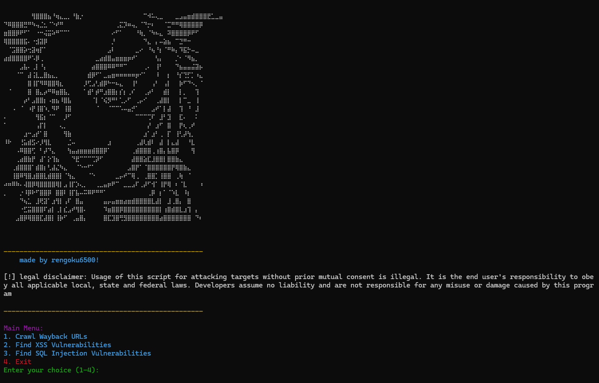

# Selamat - Automated Vulnerability Scanner (No Harmful Payloads)


## Overview

As a penetration tester, one of the biggest challenges when testing client or customer websites is ensuring that the vulnerability scanners do not cause any harm. Traditional scanners may use harmful payloads, or they could get blocked by Web Application Firewalls (WAFs) or other security mechanisms.

***Selamat*** solves these problems by providing an automated vulnerability scanner that can detect common web vulnerabilities without using any harmful payloads. This tool helps identify potential security issues while ensuring the safety of the target website and avoiding detection by most firewalls.


## Features

### 1. **Wayback URL Crawling**
   - SafeScanner can gather URLs, pages, and documents from Wayback Machine URLs, avoiding the need for live crawling.
   - **Advantages:**
     - **Bypasses Web Firewalls:** Since the scanning is done using historical snapshots, it doesn’t trigger WAF rules.
     - **No Heavy Traffic Impact:** The scanning process won’t flood the target website with traffic.
     
   This feature helps gather information without the risk of getting blocked or causing undue stress on the website.

### 2. **SQL Injection Detection**
   - Traditional SQLi scanners use harmful payloads, which can result in unintended effects. SafeScanner minimizes this risk by detecting SQL injection vulnerabilities with just a **single apostrophe (`'`)**.
   - **How It Works:**
     - The tool inserts a single apostrophe and a double apostrophe into the input fields and checks for unusual website responses.
     - Based on predefined patterns, Selamat can automatically determine if a parameter is vulnerable to SQL injection without causing harm.

### 3. **Cross-Site Scripting (XSS) Detection**
   - Most XSS scanners use payloads like `<script>alert(1)</script>` to test for vulnerabilities, but this approach can trigger security defenses.
   - Selamat adopts a safer, smarter method: **detecting reflected user input**.
   - **How It Works:**
     - The tool inserts the word **"RENGOKU<>"** into the input fields.
     - If this word is reflected back on the page, the tool will flag the URL.

## Advantages

- **Very Hard to Detect by Firewalls:** By avoiding harmful payloads, this tool can bypass most web application firewalls (WAFs).
- **Safe to Use:** The primary goal of this tool is to provide a safe scanning environment. It does not cause harm to the website being tested and avoids triggering security defenses.
  
## Limitations

- **Not Suitable for Beginners:** To effectively use this tool, you should understand the basic concepts behind vulnerabilities like SQL injection and XSS. A basic knowledge of web application security is required.
- **Manual Testing After Detection:** While this tool can identify potential vulnerabilities, **manual verification** and further testing are still necessary after detection. SafeScanner automates the discovery process, but you must conduct a manual review for final confirmation.
-  **Get Parameter:** For now, Selamat can only scan GET parameter

## How to Use

1. **Clone the Repository:**
   ```bash
   git clone https://github.com/rengoku6500/Selamat-Scanner.git 
   cd Selamat-Scanner
   ```

2. **Install Dependencies:**
   Install any required libraries and dependencies.

   ```bash
   pip install coloroma
   pip install requests
   go install github.com/tomnomnom/waybackurls@latest
   python(can be installed at https://www.python.org/)
   golang(can be installed at https://go.dev/)
   ```

3. **Run the Tool:**
   Use the command-line interface to start the scanning process.

   ```bash
   python3 main.py
   ```

   you can also scan using your own custom text file that contains a list of url.

## Contributing

Feel free to report any bugs or suggest improvements.

## License

This project is licensed under the MIT License - see the [LICENSE](LICENSE) file for details.
